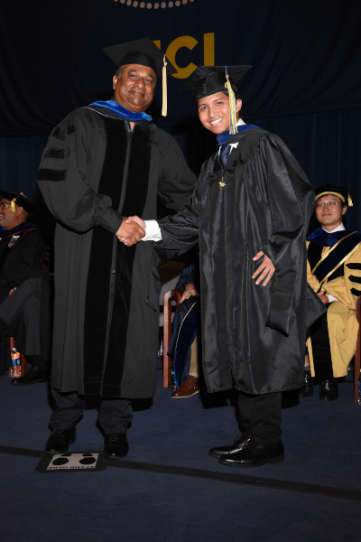

----

<left></left>

# Introduction

My name is J. Steven Raquel. I graduated from the University of California, Irvine with an M.S. in Statistics in 2023, and from the University of California, Santa Barbara, with a B.S. in Statistical Science in 2018. I am currently employed with California Department of Social Services with the classification of Research Data Specialist. Apart from proudly representing my home state as a public servant, I am also proud to call myself a child of immigrants, a person of color, and a member of the LGBTQ+ community. 

* Pronouns: he/him/they/them 
* Email: contact@jsrql.mozmail.com
* GitHub: [jstevenr](https://github.com/jstevenr)
* LinkedIn: [jstevenr](https://www.linkedin.com/in/jstevenr/)

### Frequently Asked Questions (FAQ)

**1) How did you end up studying statistics?**

I started out as a pre-economics major when I was a first-year at UC Santa Barbara. At some point I ended up switching into the pre-financial math and statistics track and enjoyed the math/statistics coursework so much that I eventually switched into the full statistics degree. 

**2) What lead you to working in public policy?**

During my masters program, under the recommendation of a statistics professor, I started doing research under a public policy professor which inspired me to shift my career focus and showed me ways that I could use my skills and knowledge for the public good. 

**3) What does the 'J' in your name stand for? What do you prefer to go by?**

“J. Steven” is my first name. My paternal grandfather’s name was Juan, and his father’s name was Esteban, so I was named in honor of both of them. Many of my friends call me J, but my family and colleagues call me Steven. Feel free to refer to me as you please. 

**4) What are your other interests?**

In my free time I am an avid PC gamer. Among my other interests are cooking, chess, specialty coffee, films, and foreign languages. I am also a proud uncle to my niece and nephew.

**5) Can you explain why you listed "he" and "they" as pronouns?**

Either masculine (he/him/his) or gender-neutral (they/them/theirs) pronouns work for me! As a [non-binary](https://www.verywellmind.com/what-does-it-mean-to-be-non-binary-or-have-non-binary-gender-4172702) person, I do not always experience my gender internally as exclusively male or female, and these gender-neutral pronouns help affirm that aspect of myself. 
